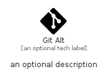

# GitAlt


```text
fontawesome/Brands/GitAlt
```

```text
include('fontawesome/Brands/GitAlt')
```


| Illustration | GitAlt |
| :---: | :---: |
|  |  |


## Sprites
The item provides the following sriptes:

- `<$GitAltXs>`
- `<$GitAltSm>`
- `<$GitAltMd>`
- `<$GitAltLg>`


## GitAlt

### Load remotely
```plantuml
@startuml
' configures the library
!global $LIB_BASE_LOCATION="https://raw.githubusercontent.com/tmorin/plantuml-libs/master/distribution"

' loads the library's bootstrap
!include $LIB_BASE_LOCATION/bootstrap.puml

' loads the package bootstrap
include('fontawesome/bootstrap')

' loads the Item which embeds the element GitAlt
include('fontawesome/Brands/GitAlt')

' renders the element
GitAlt('GitAlt', 'Git Alt', 'an optional tech label', 'an optional description')
@enduml
```

### Load locally
```plantuml
@startuml
' configures the library
!global $INCLUSION_MODE="local"
!global $LIB_BASE_LOCATION="../.."

' loads the library's bootstrap
!include $LIB_BASE_LOCATION/bootstrap.puml

' loads the package bootstrap
include('fontawesome/bootstrap')

' loads the Item which embeds the element GitAlt
include('fontawesome/Brands/GitAlt')

' renders the element
GitAlt('GitAlt', 'Git Alt', 'an optional tech label', 'an optional description')
@enduml
```

