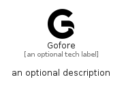

# Gofore


```text
fontawesome/Brands/Gofore
```

```text
include('fontawesome/Brands/Gofore')
```


| Illustration | Gofore |
| :---: | :---: |
|  |  |


## Sprites
The item provides the following sriptes:

- `<$GoforeXs>`
- `<$GoforeSm>`
- `<$GoforeMd>`
- `<$GoforeLg>`


## Gofore

### Load remotely
```plantuml
@startuml
' configures the library
!global $LIB_BASE_LOCATION="https://raw.githubusercontent.com/tmorin/plantuml-libs/master/distribution"

' loads the library's bootstrap
!include $LIB_BASE_LOCATION/bootstrap.puml

' loads the package bootstrap
include('fontawesome/bootstrap')

' loads the Item which embeds the element Gofore
include('fontawesome/Brands/Gofore')

' renders the element
Gofore('Gofore', 'Gofore', 'an optional tech label', 'an optional description')
@enduml
```

### Load locally
```plantuml
@startuml
' configures the library
!global $INCLUSION_MODE="local"
!global $LIB_BASE_LOCATION="../.."

' loads the library's bootstrap
!include $LIB_BASE_LOCATION/bootstrap.puml

' loads the package bootstrap
include('fontawesome/bootstrap')

' loads the Item which embeds the element Gofore
include('fontawesome/Brands/Gofore')

' renders the element
Gofore('Gofore', 'Gofore', 'an optional tech label', 'an optional description')
@enduml
```

