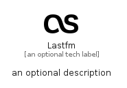

# Lastfm


```text
fontawesome/Brands/Lastfm
```

```text
include('fontawesome/Brands/Lastfm')
```


| Illustration | Lastfm |
| :---: | :---: |
|  |  |


## Sprites
The item provides the following sriptes:

- `<$LastfmXs>`
- `<$LastfmSm>`
- `<$LastfmMd>`
- `<$LastfmLg>`


## Lastfm

### Load remotely
```plantuml
@startuml
' configures the library
!global $LIB_BASE_LOCATION="https://raw.githubusercontent.com/tmorin/plantuml-libs/master/distribution"

' loads the library's bootstrap
!include $LIB_BASE_LOCATION/bootstrap.puml

' loads the package bootstrap
include('fontawesome/bootstrap')

' loads the Item which embeds the element Lastfm
include('fontawesome/Brands/Lastfm')

' renders the element
Lastfm('Lastfm', 'Lastfm', 'an optional tech label', 'an optional description')
@enduml
```

### Load locally
```plantuml
@startuml
' configures the library
!global $INCLUSION_MODE="local"
!global $LIB_BASE_LOCATION="../.."

' loads the library's bootstrap
!include $LIB_BASE_LOCATION/bootstrap.puml

' loads the package bootstrap
include('fontawesome/bootstrap')

' loads the Item which embeds the element Lastfm
include('fontawesome/Brands/Lastfm')

' renders the element
Lastfm('Lastfm', 'Lastfm', 'an optional tech label', 'an optional description')
@enduml
```

