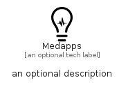

# Medapps


```text
fontawesome/Brands/Medapps
```

```text
include('fontawesome/Brands/Medapps')
```


| Illustration | Medapps |
| :---: | :---: |
|  |  |


## Sprites
The item provides the following sriptes:

- `<$MedappsXs>`
- `<$MedappsSm>`
- `<$MedappsMd>`
- `<$MedappsLg>`


## Medapps

### Load remotely
```plantuml
@startuml
' configures the library
!global $LIB_BASE_LOCATION="https://raw.githubusercontent.com/tmorin/plantuml-libs/master/distribution"

' loads the library's bootstrap
!include $LIB_BASE_LOCATION/bootstrap.puml

' loads the package bootstrap
include('fontawesome/bootstrap')

' loads the Item which embeds the element Medapps
include('fontawesome/Brands/Medapps')

' renders the element
Medapps('Medapps', 'Medapps', 'an optional tech label', 'an optional description')
@enduml
```

### Load locally
```plantuml
@startuml
' configures the library
!global $INCLUSION_MODE="local"
!global $LIB_BASE_LOCATION="../.."

' loads the library's bootstrap
!include $LIB_BASE_LOCATION/bootstrap.puml

' loads the package bootstrap
include('fontawesome/bootstrap')

' loads the Item which embeds the element Medapps
include('fontawesome/Brands/Medapps')

' renders the element
Medapps('Medapps', 'Medapps', 'an optional tech label', 'an optional description')
@enduml
```

