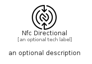

# NfcDirectional


```text
fontawesome/Brands/NfcDirectional
```

```text
include('fontawesome/Brands/NfcDirectional')
```


| Illustration | NfcDirectional |
| :---: | :---: |
|  |  |


## Sprites
The item provides the following sriptes:

- `<$NfcDirectionalXs>`
- `<$NfcDirectionalSm>`
- `<$NfcDirectionalMd>`
- `<$NfcDirectionalLg>`


## NfcDirectional

### Load remotely
```plantuml
@startuml
' configures the library
!global $LIB_BASE_LOCATION="https://raw.githubusercontent.com/tmorin/plantuml-libs/master/distribution"

' loads the library's bootstrap
!include $LIB_BASE_LOCATION/bootstrap.puml

' loads the package bootstrap
include('fontawesome/bootstrap')

' loads the Item which embeds the element NfcDirectional
include('fontawesome/Brands/NfcDirectional')

' renders the element
NfcDirectional('NfcDirectional', 'Nfc Directional', 'an optional tech label', 'an optional description')
@enduml
```

### Load locally
```plantuml
@startuml
' configures the library
!global $INCLUSION_MODE="local"
!global $LIB_BASE_LOCATION="../.."

' loads the library's bootstrap
!include $LIB_BASE_LOCATION/bootstrap.puml

' loads the package bootstrap
include('fontawesome/bootstrap')

' loads the Item which embeds the element NfcDirectional
include('fontawesome/Brands/NfcDirectional')

' renders the element
NfcDirectional('NfcDirectional', 'Nfc Directional', 'an optional tech label', 'an optional description')
@enduml
```

