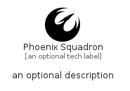

# PhoenixSquadron


```text
fontawesome/Brands/PhoenixSquadron
```

```text
include('fontawesome/Brands/PhoenixSquadron')
```


| Illustration | PhoenixSquadron |
| :---: | :---: |
|  |  |


## Sprites
The item provides the following sriptes:

- `<$PhoenixSquadronXs>`
- `<$PhoenixSquadronSm>`
- `<$PhoenixSquadronMd>`
- `<$PhoenixSquadronLg>`


## PhoenixSquadron

### Load remotely
```plantuml
@startuml
' configures the library
!global $LIB_BASE_LOCATION="https://raw.githubusercontent.com/tmorin/plantuml-libs/master/distribution"

' loads the library's bootstrap
!include $LIB_BASE_LOCATION/bootstrap.puml

' loads the package bootstrap
include('fontawesome/bootstrap')

' loads the Item which embeds the element PhoenixSquadron
include('fontawesome/Brands/PhoenixSquadron')

' renders the element
PhoenixSquadron('PhoenixSquadron', 'Phoenix Squadron', 'an optional tech label', 'an optional description')
@enduml
```

### Load locally
```plantuml
@startuml
' configures the library
!global $INCLUSION_MODE="local"
!global $LIB_BASE_LOCATION="../.."

' loads the library's bootstrap
!include $LIB_BASE_LOCATION/bootstrap.puml

' loads the package bootstrap
include('fontawesome/bootstrap')

' loads the Item which embeds the element PhoenixSquadron
include('fontawesome/Brands/PhoenixSquadron')

' renders the element
PhoenixSquadron('PhoenixSquadron', 'Phoenix Squadron', 'an optional tech label', 'an optional description')
@enduml
```

