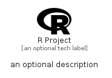

# RProject


```text
fontawesome/Brands/RProject
```

```text
include('fontawesome/Brands/RProject')
```


| Illustration | RProject |
| :---: | :---: |
|  |  |


## Sprites
The item provides the following sriptes:

- `<$RProjectXs>`
- `<$RProjectSm>`
- `<$RProjectMd>`
- `<$RProjectLg>`


## RProject

### Load remotely
```plantuml
@startuml
' configures the library
!global $LIB_BASE_LOCATION="https://raw.githubusercontent.com/tmorin/plantuml-libs/master/distribution"

' loads the library's bootstrap
!include $LIB_BASE_LOCATION/bootstrap.puml

' loads the package bootstrap
include('fontawesome/bootstrap')

' loads the Item which embeds the element RProject
include('fontawesome/Brands/RProject')

' renders the element
RProject('RProject', 'R Project', 'an optional tech label', 'an optional description')
@enduml
```

### Load locally
```plantuml
@startuml
' configures the library
!global $INCLUSION_MODE="local"
!global $LIB_BASE_LOCATION="../.."

' loads the library's bootstrap
!include $LIB_BASE_LOCATION/bootstrap.puml

' loads the package bootstrap
include('fontawesome/bootstrap')

' loads the Item which embeds the element RProject
include('fontawesome/Brands/RProject')

' renders the element
RProject('RProject', 'R Project', 'an optional tech label', 'an optional description')
@enduml
```

