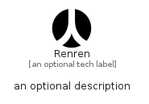

# Renren


```text
fontawesome/Brands/Renren
```

```text
include('fontawesome/Brands/Renren')
```


| Illustration | Renren |
| :---: | :---: |
|  |  |


## Sprites
The item provides the following sriptes:

- `<$RenrenXs>`
- `<$RenrenSm>`
- `<$RenrenMd>`
- `<$RenrenLg>`


## Renren

### Load remotely
```plantuml
@startuml
' configures the library
!global $LIB_BASE_LOCATION="https://raw.githubusercontent.com/tmorin/plantuml-libs/master/distribution"

' loads the library's bootstrap
!include $LIB_BASE_LOCATION/bootstrap.puml

' loads the package bootstrap
include('fontawesome/bootstrap')

' loads the Item which embeds the element Renren
include('fontawesome/Brands/Renren')

' renders the element
Renren('Renren', 'Renren', 'an optional tech label', 'an optional description')
@enduml
```

### Load locally
```plantuml
@startuml
' configures the library
!global $INCLUSION_MODE="local"
!global $LIB_BASE_LOCATION="../.."

' loads the library's bootstrap
!include $LIB_BASE_LOCATION/bootstrap.puml

' loads the package bootstrap
include('fontawesome/bootstrap')

' loads the Item which embeds the element Renren
include('fontawesome/Brands/Renren')

' renders the element
Renren('Renren', 'Renren', 'an optional tech label', 'an optional description')
@enduml
```

