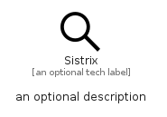

# Sistrix


```text
fontawesome/Brands/Sistrix
```

```text
include('fontawesome/Brands/Sistrix')
```


| Illustration | Sistrix |
| :---: | :---: |
|  |  |


## Sprites
The item provides the following sriptes:

- `<$SistrixXs>`
- `<$SistrixSm>`
- `<$SistrixMd>`
- `<$SistrixLg>`


## Sistrix

### Load remotely
```plantuml
@startuml
' configures the library
!global $LIB_BASE_LOCATION="https://raw.githubusercontent.com/tmorin/plantuml-libs/master/distribution"

' loads the library's bootstrap
!include $LIB_BASE_LOCATION/bootstrap.puml

' loads the package bootstrap
include('fontawesome/bootstrap')

' loads the Item which embeds the element Sistrix
include('fontawesome/Brands/Sistrix')

' renders the element
Sistrix('Sistrix', 'Sistrix', 'an optional tech label', 'an optional description')
@enduml
```

### Load locally
```plantuml
@startuml
' configures the library
!global $INCLUSION_MODE="local"
!global $LIB_BASE_LOCATION="../.."

' loads the library's bootstrap
!include $LIB_BASE_LOCATION/bootstrap.puml

' loads the package bootstrap
include('fontawesome/bootstrap')

' loads the Item which embeds the element Sistrix
include('fontawesome/Brands/Sistrix')

' renders the element
Sistrix('Sistrix', 'Sistrix', 'an optional tech label', 'an optional description')
@enduml
```

