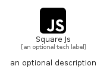

# SquareJs


```text
fontawesome/Brands/SquareJs
```

```text
include('fontawesome/Brands/SquareJs')
```


| Illustration | SquareJs |
| :---: | :---: |
|  |  |


## Sprites
The item provides the following sriptes:

- `<$SquareJsXs>`
- `<$SquareJsSm>`
- `<$SquareJsMd>`
- `<$SquareJsLg>`


## SquareJs

### Load remotely
```plantuml
@startuml
' configures the library
!global $LIB_BASE_LOCATION="https://raw.githubusercontent.com/tmorin/plantuml-libs/master/distribution"

' loads the library's bootstrap
!include $LIB_BASE_LOCATION/bootstrap.puml

' loads the package bootstrap
include('fontawesome/bootstrap')

' loads the Item which embeds the element SquareJs
include('fontawesome/Brands/SquareJs')

' renders the element
SquareJs('SquareJs', 'Square Js', 'an optional tech label', 'an optional description')
@enduml
```

### Load locally
```plantuml
@startuml
' configures the library
!global $INCLUSION_MODE="local"
!global $LIB_BASE_LOCATION="../.."

' loads the library's bootstrap
!include $LIB_BASE_LOCATION/bootstrap.puml

' loads the package bootstrap
include('fontawesome/bootstrap')

' loads the Item which embeds the element SquareJs
include('fontawesome/Brands/SquareJs')

' renders the element
SquareJs('SquareJs', 'Square Js', 'an optional tech label', 'an optional description')
@enduml
```

