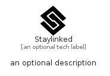

# Staylinked


```text
fontawesome/Brands/Staylinked
```

```text
include('fontawesome/Brands/Staylinked')
```


| Illustration | Staylinked |
| :---: | :---: |
|  |  |


## Sprites
The item provides the following sriptes:

- `<$StaylinkedXs>`
- `<$StaylinkedSm>`
- `<$StaylinkedMd>`
- `<$StaylinkedLg>`


## Staylinked

### Load remotely
```plantuml
@startuml
' configures the library
!global $LIB_BASE_LOCATION="https://raw.githubusercontent.com/tmorin/plantuml-libs/master/distribution"

' loads the library's bootstrap
!include $LIB_BASE_LOCATION/bootstrap.puml

' loads the package bootstrap
include('fontawesome/bootstrap')

' loads the Item which embeds the element Staylinked
include('fontawesome/Brands/Staylinked')

' renders the element
Staylinked('Staylinked', 'Staylinked', 'an optional tech label', 'an optional description')
@enduml
```

### Load locally
```plantuml
@startuml
' configures the library
!global $INCLUSION_MODE="local"
!global $LIB_BASE_LOCATION="../.."

' loads the library's bootstrap
!include $LIB_BASE_LOCATION/bootstrap.puml

' loads the package bootstrap
include('fontawesome/bootstrap')

' loads the Item which embeds the element Staylinked
include('fontawesome/Brands/Staylinked')

' renders the element
Staylinked('Staylinked', 'Staylinked', 'an optional tech label', 'an optional description')
@enduml
```

