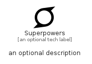

# Superpowers


```text
fontawesome/Brands/Superpowers
```

```text
include('fontawesome/Brands/Superpowers')
```


| Illustration | Superpowers |
| :---: | :---: |
|  |  |


## Sprites
The item provides the following sriptes:

- `<$SuperpowersXs>`
- `<$SuperpowersSm>`
- `<$SuperpowersMd>`
- `<$SuperpowersLg>`


## Superpowers

### Load remotely
```plantuml
@startuml
' configures the library
!global $LIB_BASE_LOCATION="https://raw.githubusercontent.com/tmorin/plantuml-libs/master/distribution"

' loads the library's bootstrap
!include $LIB_BASE_LOCATION/bootstrap.puml

' loads the package bootstrap
include('fontawesome/bootstrap')

' loads the Item which embeds the element Superpowers
include('fontawesome/Brands/Superpowers')

' renders the element
Superpowers('Superpowers', 'Superpowers', 'an optional tech label', 'an optional description')
@enduml
```

### Load locally
```plantuml
@startuml
' configures the library
!global $INCLUSION_MODE="local"
!global $LIB_BASE_LOCATION="../.."

' loads the library's bootstrap
!include $LIB_BASE_LOCATION/bootstrap.puml

' loads the package bootstrap
include('fontawesome/bootstrap')

' loads the Item which embeds the element Superpowers
include('fontawesome/Brands/Superpowers')

' renders the element
Superpowers('Superpowers', 'Superpowers', 'an optional tech label', 'an optional description')
@enduml
```

