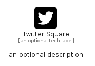

# TwitterSquare


```text
fontawesome/Brands/TwitterSquare
```

```text
include('fontawesome/Brands/TwitterSquare')
```


| Illustration | TwitterSquare |
| :---: | :---: |
|  |  |


## Sprites
The item provides the following sriptes:

- `<$TwitterSquareXs>`
- `<$TwitterSquareSm>`
- `<$TwitterSquareMd>`
- `<$TwitterSquareLg>`


## TwitterSquare

### Load remotely
```plantuml
@startuml
' configures the library
!global $LIB_BASE_LOCATION="https://raw.githubusercontent.com/tmorin/plantuml-libs/master/distribution"

' loads the library's bootstrap
!include $LIB_BASE_LOCATION/bootstrap.puml

' loads the package bootstrap
include('fontawesome/bootstrap')

' loads the Item which embeds the element TwitterSquare
include('fontawesome/Brands/TwitterSquare')

' renders the element
TwitterSquare('TwitterSquare', 'Twitter Square', 'an optional tech label', 'an optional description')
@enduml
```

### Load locally
```plantuml
@startuml
' configures the library
!global $INCLUSION_MODE="local"
!global $LIB_BASE_LOCATION="../.."

' loads the library's bootstrap
!include $LIB_BASE_LOCATION/bootstrap.puml

' loads the package bootstrap
include('fontawesome/bootstrap')

' loads the Item which embeds the element TwitterSquare
include('fontawesome/Brands/TwitterSquare')

' renders the element
TwitterSquare('TwitterSquare', 'Twitter Square', 'an optional tech label', 'an optional description')
@enduml
```

