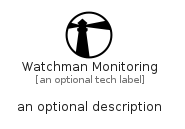

# WatchmanMonitoring


```text
fontawesome/Brands/WatchmanMonitoring
```

```text
include('fontawesome/Brands/WatchmanMonitoring')
```


| Illustration | WatchmanMonitoring |
| :---: | :---: |
|  |  |


## Sprites
The item provides the following sriptes:

- `<$WatchmanMonitoringXs>`
- `<$WatchmanMonitoringSm>`
- `<$WatchmanMonitoringMd>`
- `<$WatchmanMonitoringLg>`


## WatchmanMonitoring

### Load remotely
```plantuml
@startuml
' configures the library
!global $LIB_BASE_LOCATION="https://raw.githubusercontent.com/tmorin/plantuml-libs/master/distribution"

' loads the library's bootstrap
!include $LIB_BASE_LOCATION/bootstrap.puml

' loads the package bootstrap
include('fontawesome/bootstrap')

' loads the Item which embeds the element WatchmanMonitoring
include('fontawesome/Brands/WatchmanMonitoring')

' renders the element
WatchmanMonitoring('WatchmanMonitoring', 'Watchman Monitoring', 'an optional tech label', 'an optional description')
@enduml
```

### Load locally
```plantuml
@startuml
' configures the library
!global $INCLUSION_MODE="local"
!global $LIB_BASE_LOCATION="../.."

' loads the library's bootstrap
!include $LIB_BASE_LOCATION/bootstrap.puml

' loads the package bootstrap
include('fontawesome/bootstrap')

' loads the Item which embeds the element WatchmanMonitoring
include('fontawesome/Brands/WatchmanMonitoring')

' renders the element
WatchmanMonitoring('WatchmanMonitoring', 'Watchman Monitoring', 'an optional tech label', 'an optional description')
@enduml
```

