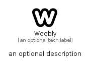

# Weebly


```text
fontawesome/Brands/Weebly
```

```text
include('fontawesome/Brands/Weebly')
```


| Illustration | Weebly |
| :---: | :---: |
|  |  |


## Sprites
The item provides the following sriptes:

- `<$WeeblyXs>`
- `<$WeeblySm>`
- `<$WeeblyMd>`
- `<$WeeblyLg>`


## Weebly

### Load remotely
```plantuml
@startuml
' configures the library
!global $LIB_BASE_LOCATION="https://raw.githubusercontent.com/tmorin/plantuml-libs/master/distribution"

' loads the library's bootstrap
!include $LIB_BASE_LOCATION/bootstrap.puml

' loads the package bootstrap
include('fontawesome/bootstrap')

' loads the Item which embeds the element Weebly
include('fontawesome/Brands/Weebly')

' renders the element
Weebly('Weebly', 'Weebly', 'an optional tech label', 'an optional description')
@enduml
```

### Load locally
```plantuml
@startuml
' configures the library
!global $INCLUSION_MODE="local"
!global $LIB_BASE_LOCATION="../.."

' loads the library's bootstrap
!include $LIB_BASE_LOCATION/bootstrap.puml

' loads the package bootstrap
include('fontawesome/bootstrap')

' loads the Item which embeds the element Weebly
include('fontawesome/Brands/Weebly')

' renders the element
Weebly('Weebly', 'Weebly', 'an optional tech label', 'an optional description')
@enduml
```

