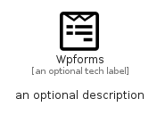

# Wpforms


```text
fontawesome/Brands/Wpforms
```

```text
include('fontawesome/Brands/Wpforms')
```


| Illustration | Wpforms |
| :---: | :---: |
|  |  |


## Sprites
The item provides the following sriptes:

- `<$WpformsXs>`
- `<$WpformsSm>`
- `<$WpformsMd>`
- `<$WpformsLg>`


## Wpforms

### Load remotely
```plantuml
@startuml
' configures the library
!global $LIB_BASE_LOCATION="https://raw.githubusercontent.com/tmorin/plantuml-libs/master/distribution"

' loads the library's bootstrap
!include $LIB_BASE_LOCATION/bootstrap.puml

' loads the package bootstrap
include('fontawesome/bootstrap')

' loads the Item which embeds the element Wpforms
include('fontawesome/Brands/Wpforms')

' renders the element
Wpforms('Wpforms', 'Wpforms', 'an optional tech label', 'an optional description')
@enduml
```

### Load locally
```plantuml
@startuml
' configures the library
!global $INCLUSION_MODE="local"
!global $LIB_BASE_LOCATION="../.."

' loads the library's bootstrap
!include $LIB_BASE_LOCATION/bootstrap.puml

' loads the package bootstrap
include('fontawesome/bootstrap')

' loads the Item which embeds the element Wpforms
include('fontawesome/Brands/Wpforms')

' renders the element
Wpforms('Wpforms', 'Wpforms', 'an optional tech label', 'an optional description')
@enduml
```

