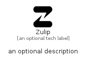

# Zulip


```text
fontawesome/Brands/Zulip
```

```text
include('fontawesome/Brands/Zulip')
```


| Illustration | Zulip |
| :---: | :---: |
|  |  |


## Sprites
The item provides the following sriptes:

- `<$ZulipXs>`
- `<$ZulipSm>`
- `<$ZulipMd>`
- `<$ZulipLg>`


## Zulip

### Load remotely
```plantuml
@startuml
' configures the library
!global $LIB_BASE_LOCATION="https://raw.githubusercontent.com/tmorin/plantuml-libs/master/distribution"

' loads the library's bootstrap
!include $LIB_BASE_LOCATION/bootstrap.puml

' loads the package bootstrap
include('fontawesome/bootstrap')

' loads the Item which embeds the element Zulip
include('fontawesome/Brands/Zulip')

' renders the element
Zulip('Zulip', 'Zulip', 'an optional tech label', 'an optional description')
@enduml
```

### Load locally
```plantuml
@startuml
' configures the library
!global $INCLUSION_MODE="local"
!global $LIB_BASE_LOCATION="../.."

' loads the library's bootstrap
!include $LIB_BASE_LOCATION/bootstrap.puml

' loads the package bootstrap
include('fontawesome/bootstrap')

' loads the Item which embeds the element Zulip
include('fontawesome/Brands/Zulip')

' renders the element
Zulip('Zulip', 'Zulip', 'an optional tech label', 'an optional description')
@enduml
```

