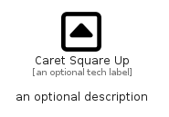

# CaretSquareUp


```text
fontawesome/Regular/CaretSquareUp
```

```text
include('fontawesome/Regular/CaretSquareUp')
```


| Illustration | CaretSquareUp |
| :---: | :---: |
|  |  |


## Sprites
The item provides the following sriptes:

- `<$CaretSquareUpXs>`
- `<$CaretSquareUpSm>`
- `<$CaretSquareUpMd>`
- `<$CaretSquareUpLg>`


## CaretSquareUp

### Load remotely
```plantuml
@startuml
' configures the library
!global $LIB_BASE_LOCATION="https://raw.githubusercontent.com/tmorin/plantuml-libs/master/distribution"

' loads the library's bootstrap
!include $LIB_BASE_LOCATION/bootstrap.puml

' loads the package bootstrap
include('fontawesome/bootstrap')

' loads the Item which embeds the element CaretSquareUp
include('fontawesome/Regular/CaretSquareUp')

' renders the element
CaretSquareUp('CaretSquareUp', 'Caret Square Up', 'an optional tech label', 'an optional description')
@enduml
```

### Load locally
```plantuml
@startuml
' configures the library
!global $INCLUSION_MODE="local"
!global $LIB_BASE_LOCATION="../.."

' loads the library's bootstrap
!include $LIB_BASE_LOCATION/bootstrap.puml

' loads the package bootstrap
include('fontawesome/bootstrap')

' loads the Item which embeds the element CaretSquareUp
include('fontawesome/Regular/CaretSquareUp')

' renders the element
CaretSquareUp('CaretSquareUp', 'Caret Square Up', 'an optional tech label', 'an optional description')
@enduml
```

