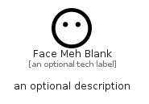

# FaceMehBlank


```text
fontawesome/Regular/FaceMehBlank
```

```text
include('fontawesome/Regular/FaceMehBlank')
```


| Illustration | FaceMehBlank |
| :---: | :---: |
|  |  |


## Sprites
The item provides the following sriptes:

- `<$FaceMehBlankXs>`
- `<$FaceMehBlankSm>`
- `<$FaceMehBlankMd>`
- `<$FaceMehBlankLg>`


## FaceMehBlank

### Load remotely
```plantuml
@startuml
' configures the library
!global $LIB_BASE_LOCATION="https://raw.githubusercontent.com/tmorin/plantuml-libs/master/distribution"

' loads the library's bootstrap
!include $LIB_BASE_LOCATION/bootstrap.puml

' loads the package bootstrap
include('fontawesome/bootstrap')

' loads the Item which embeds the element FaceMehBlank
include('fontawesome/Regular/FaceMehBlank')

' renders the element
FaceMehBlank('FaceMehBlank', 'Face Meh Blank', 'an optional tech label', 'an optional description')
@enduml
```

### Load locally
```plantuml
@startuml
' configures the library
!global $INCLUSION_MODE="local"
!global $LIB_BASE_LOCATION="../.."

' loads the library's bootstrap
!include $LIB_BASE_LOCATION/bootstrap.puml

' loads the package bootstrap
include('fontawesome/bootstrap')

' loads the Item which embeds the element FaceMehBlank
include('fontawesome/Regular/FaceMehBlank')

' renders the element
FaceMehBlank('FaceMehBlank', 'Face Meh Blank', 'an optional tech label', 'an optional description')
@enduml
```

