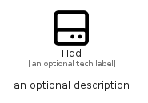

# Hdd


```text
fontawesome/Regular/Hdd
```

```text
include('fontawesome/Regular/Hdd')
```


| Illustration | Hdd |
| :---: | :---: |
|  |  |


## Sprites
The item provides the following sriptes:

- `<$HddXs>`
- `<$HddSm>`
- `<$HddMd>`
- `<$HddLg>`


## Hdd

### Load remotely
```plantuml
@startuml
' configures the library
!global $LIB_BASE_LOCATION="https://raw.githubusercontent.com/tmorin/plantuml-libs/master/distribution"

' loads the library's bootstrap
!include $LIB_BASE_LOCATION/bootstrap.puml

' loads the package bootstrap
include('fontawesome/bootstrap')

' loads the Item which embeds the element Hdd
include('fontawesome/Regular/Hdd')

' renders the element
Hdd('Hdd', 'Hdd', 'an optional tech label', 'an optional description')
@enduml
```

### Load locally
```plantuml
@startuml
' configures the library
!global $INCLUSION_MODE="local"
!global $LIB_BASE_LOCATION="../.."

' loads the library's bootstrap
!include $LIB_BASE_LOCATION/bootstrap.puml

' loads the package bootstrap
include('fontawesome/bootstrap')

' loads the Item which embeds the element Hdd
include('fontawesome/Regular/Hdd')

' renders the element
Hdd('Hdd', 'Hdd', 'an optional tech label', 'an optional description')
@enduml
```

