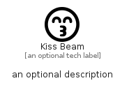

# KissBeam


```text
fontawesome/Regular/KissBeam
```

```text
include('fontawesome/Regular/KissBeam')
```


| Illustration | KissBeam |
| :---: | :---: |
|  |  |


## Sprites
The item provides the following sriptes:

- `<$KissBeamXs>`
- `<$KissBeamSm>`
- `<$KissBeamMd>`
- `<$KissBeamLg>`


## KissBeam

### Load remotely
```plantuml
@startuml
' configures the library
!global $LIB_BASE_LOCATION="https://raw.githubusercontent.com/tmorin/plantuml-libs/master/distribution"

' loads the library's bootstrap
!include $LIB_BASE_LOCATION/bootstrap.puml

' loads the package bootstrap
include('fontawesome/bootstrap')

' loads the Item which embeds the element KissBeam
include('fontawesome/Regular/KissBeam')

' renders the element
KissBeam('KissBeam', 'Kiss Beam', 'an optional tech label', 'an optional description')
@enduml
```

### Load locally
```plantuml
@startuml
' configures the library
!global $INCLUSION_MODE="local"
!global $LIB_BASE_LOCATION="../.."

' loads the library's bootstrap
!include $LIB_BASE_LOCATION/bootstrap.puml

' loads the package bootstrap
include('fontawesome/bootstrap')

' loads the Item which embeds the element KissBeam
include('fontawesome/Regular/KissBeam')

' renders the element
KissBeam('KissBeam', 'Kiss Beam', 'an optional tech label', 'an optional description')
@enduml
```

