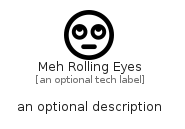

# MehRollingEyes


```text
fontawesome/Regular/MehRollingEyes
```

```text
include('fontawesome/Regular/MehRollingEyes')
```


| Illustration | MehRollingEyes |
| :---: | :---: |
|  |  |


## Sprites
The item provides the following sriptes:

- `<$MehRollingEyesXs>`
- `<$MehRollingEyesSm>`
- `<$MehRollingEyesMd>`
- `<$MehRollingEyesLg>`


## MehRollingEyes

### Load remotely
```plantuml
@startuml
' configures the library
!global $LIB_BASE_LOCATION="https://raw.githubusercontent.com/tmorin/plantuml-libs/master/distribution"

' loads the library's bootstrap
!include $LIB_BASE_LOCATION/bootstrap.puml

' loads the package bootstrap
include('fontawesome/bootstrap')

' loads the Item which embeds the element MehRollingEyes
include('fontawesome/Regular/MehRollingEyes')

' renders the element
MehRollingEyes('MehRollingEyes', 'Meh Rolling Eyes', 'an optional tech label', 'an optional description')
@enduml
```

### Load locally
```plantuml
@startuml
' configures the library
!global $INCLUSION_MODE="local"
!global $LIB_BASE_LOCATION="../.."

' loads the library's bootstrap
!include $LIB_BASE_LOCATION/bootstrap.puml

' loads the package bootstrap
include('fontawesome/bootstrap')

' loads the Item which embeds the element MehRollingEyes
include('fontawesome/Regular/MehRollingEyes')

' renders the element
MehRollingEyes('MehRollingEyes', 'Meh Rolling Eyes', 'an optional tech label', 'an optional description')
@enduml
```

