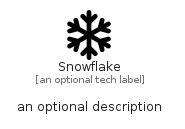

# Snowflake


```text
fontawesome/Regular/Snowflake
```

```text
include('fontawesome/Regular/Snowflake')
```


| Illustration | Snowflake |
| :---: | :---: |
|  |  |


## Sprites
The item provides the following sriptes:

- `<$SnowflakeXs>`
- `<$SnowflakeSm>`
- `<$SnowflakeMd>`
- `<$SnowflakeLg>`


## Snowflake

### Load remotely
```plantuml
@startuml
' configures the library
!global $LIB_BASE_LOCATION="https://raw.githubusercontent.com/tmorin/plantuml-libs/master/distribution"

' loads the library's bootstrap
!include $LIB_BASE_LOCATION/bootstrap.puml

' loads the package bootstrap
include('fontawesome/bootstrap')

' loads the Item which embeds the element Snowflake
include('fontawesome/Regular/Snowflake')

' renders the element
Snowflake('Snowflake', 'Snowflake', 'an optional tech label', 'an optional description')
@enduml
```

### Load locally
```plantuml
@startuml
' configures the library
!global $INCLUSION_MODE="local"
!global $LIB_BASE_LOCATION="../.."

' loads the library's bootstrap
!include $LIB_BASE_LOCATION/bootstrap.puml

' loads the package bootstrap
include('fontawesome/bootstrap')

' loads the Item which embeds the element Snowflake
include('fontawesome/Regular/Snowflake')

' renders the element
Snowflake('Snowflake', 'Snowflake', 'an optional tech label', 'an optional description')
@enduml
```

