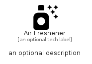

# AirFreshener


```text
fontawesome/Solid/AirFreshener
```

```text
include('fontawesome/Solid/AirFreshener')
```


| Illustration | AirFreshener |
| :---: | :---: |
|  |  |


## Sprites
The item provides the following sriptes:

- `<$AirFreshenerXs>`
- `<$AirFreshenerSm>`
- `<$AirFreshenerMd>`
- `<$AirFreshenerLg>`


## AirFreshener

### Load remotely
```plantuml
@startuml
' configures the library
!global $LIB_BASE_LOCATION="https://raw.githubusercontent.com/tmorin/plantuml-libs/master/distribution"

' loads the library's bootstrap
!include $LIB_BASE_LOCATION/bootstrap.puml

' loads the package bootstrap
include('fontawesome/bootstrap')

' loads the Item which embeds the element AirFreshener
include('fontawesome/Solid/AirFreshener')

' renders the element
AirFreshener('AirFreshener', 'Air Freshener', 'an optional tech label', 'an optional description')
@enduml
```

### Load locally
```plantuml
@startuml
' configures the library
!global $INCLUSION_MODE="local"
!global $LIB_BASE_LOCATION="../.."

' loads the library's bootstrap
!include $LIB_BASE_LOCATION/bootstrap.puml

' loads the package bootstrap
include('fontawesome/bootstrap')

' loads the Item which embeds the element AirFreshener
include('fontawesome/Solid/AirFreshener')

' renders the element
AirFreshener('AirFreshener', 'Air Freshener', 'an optional tech label', 'an optional description')
@enduml
```

