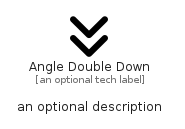

# AngleDoubleDown


```text
fontawesome/Solid/AngleDoubleDown
```

```text
include('fontawesome/Solid/AngleDoubleDown')
```


| Illustration | AngleDoubleDown |
| :---: | :---: |
|  |  |


## Sprites
The item provides the following sriptes:

- `<$AngleDoubleDownXs>`
- `<$AngleDoubleDownSm>`
- `<$AngleDoubleDownMd>`
- `<$AngleDoubleDownLg>`


## AngleDoubleDown

### Load remotely
```plantuml
@startuml
' configures the library
!global $LIB_BASE_LOCATION="https://raw.githubusercontent.com/tmorin/plantuml-libs/master/distribution"

' loads the library's bootstrap
!include $LIB_BASE_LOCATION/bootstrap.puml

' loads the package bootstrap
include('fontawesome/bootstrap')

' loads the Item which embeds the element AngleDoubleDown
include('fontawesome/Solid/AngleDoubleDown')

' renders the element
AngleDoubleDown('AngleDoubleDown', 'Angle Double Down', 'an optional tech label', 'an optional description')
@enduml
```

### Load locally
```plantuml
@startuml
' configures the library
!global $INCLUSION_MODE="local"
!global $LIB_BASE_LOCATION="../.."

' loads the library's bootstrap
!include $LIB_BASE_LOCATION/bootstrap.puml

' loads the package bootstrap
include('fontawesome/bootstrap')

' loads the Item which embeds the element AngleDoubleDown
include('fontawesome/Solid/AngleDoubleDown')

' renders the element
AngleDoubleDown('AngleDoubleDown', 'Angle Double Down', 'an optional tech label', 'an optional description')
@enduml
```

