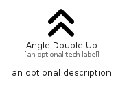

# AngleDoubleUp


```text
fontawesome/Solid/AngleDoubleUp
```

```text
include('fontawesome/Solid/AngleDoubleUp')
```


| Illustration | AngleDoubleUp |
| :---: | :---: |
|  |  |


## Sprites
The item provides the following sriptes:

- `<$AngleDoubleUpXs>`
- `<$AngleDoubleUpSm>`
- `<$AngleDoubleUpMd>`
- `<$AngleDoubleUpLg>`


## AngleDoubleUp

### Load remotely
```plantuml
@startuml
' configures the library
!global $LIB_BASE_LOCATION="https://raw.githubusercontent.com/tmorin/plantuml-libs/master/distribution"

' loads the library's bootstrap
!include $LIB_BASE_LOCATION/bootstrap.puml

' loads the package bootstrap
include('fontawesome/bootstrap')

' loads the Item which embeds the element AngleDoubleUp
include('fontawesome/Solid/AngleDoubleUp')

' renders the element
AngleDoubleUp('AngleDoubleUp', 'Angle Double Up', 'an optional tech label', 'an optional description')
@enduml
```

### Load locally
```plantuml
@startuml
' configures the library
!global $INCLUSION_MODE="local"
!global $LIB_BASE_LOCATION="../.."

' loads the library's bootstrap
!include $LIB_BASE_LOCATION/bootstrap.puml

' loads the package bootstrap
include('fontawesome/bootstrap')

' loads the Item which embeds the element AngleDoubleUp
include('fontawesome/Solid/AngleDoubleUp')

' renders the element
AngleDoubleUp('AngleDoubleUp', 'Angle Double Up', 'an optional tech label', 'an optional description')
@enduml
```

