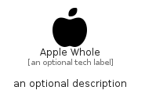

# AppleWhole


```text
fontawesome/Solid/AppleWhole
```

```text
include('fontawesome/Solid/AppleWhole')
```


| Illustration | AppleWhole |
| :---: | :---: |
|  |  |


## Sprites
The item provides the following sriptes:

- `<$AppleWholeXs>`
- `<$AppleWholeSm>`
- `<$AppleWholeMd>`
- `<$AppleWholeLg>`


## AppleWhole

### Load remotely
```plantuml
@startuml
' configures the library
!global $LIB_BASE_LOCATION="https://raw.githubusercontent.com/tmorin/plantuml-libs/master/distribution"

' loads the library's bootstrap
!include $LIB_BASE_LOCATION/bootstrap.puml

' loads the package bootstrap
include('fontawesome/bootstrap')

' loads the Item which embeds the element AppleWhole
include('fontawesome/Solid/AppleWhole')

' renders the element
AppleWhole('AppleWhole', 'Apple Whole', 'an optional tech label', 'an optional description')
@enduml
```

### Load locally
```plantuml
@startuml
' configures the library
!global $INCLUSION_MODE="local"
!global $LIB_BASE_LOCATION="../.."

' loads the library's bootstrap
!include $LIB_BASE_LOCATION/bootstrap.puml

' loads the package bootstrap
include('fontawesome/bootstrap')

' loads the Item which embeds the element AppleWhole
include('fontawesome/Solid/AppleWhole')

' renders the element
AppleWhole('AppleWhole', 'Apple Whole', 'an optional tech label', 'an optional description')
@enduml
```

