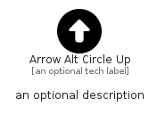

# ArrowAltCircleUp


```text
fontawesome/Solid/ArrowAltCircleUp
```

```text
include('fontawesome/Solid/ArrowAltCircleUp')
```


| Illustration | ArrowAltCircleUp |
| :---: | :---: |
|  |  |


## Sprites
The item provides the following sriptes:

- `<$ArrowAltCircleUpXs>`
- `<$ArrowAltCircleUpSm>`
- `<$ArrowAltCircleUpMd>`
- `<$ArrowAltCircleUpLg>`


## ArrowAltCircleUp

### Load remotely
```plantuml
@startuml
' configures the library
!global $LIB_BASE_LOCATION="https://raw.githubusercontent.com/tmorin/plantuml-libs/master/distribution"

' loads the library's bootstrap
!include $LIB_BASE_LOCATION/bootstrap.puml

' loads the package bootstrap
include('fontawesome/bootstrap')

' loads the Item which embeds the element ArrowAltCircleUp
include('fontawesome/Solid/ArrowAltCircleUp')

' renders the element
ArrowAltCircleUp('ArrowAltCircleUp', 'Arrow Alt Circle Up', 'an optional tech label', 'an optional description')
@enduml
```

### Load locally
```plantuml
@startuml
' configures the library
!global $INCLUSION_MODE="local"
!global $LIB_BASE_LOCATION="../.."

' loads the library's bootstrap
!include $LIB_BASE_LOCATION/bootstrap.puml

' loads the package bootstrap
include('fontawesome/bootstrap')

' loads the Item which embeds the element ArrowAltCircleUp
include('fontawesome/Solid/ArrowAltCircleUp')

' renders the element
ArrowAltCircleUp('ArrowAltCircleUp', 'Arrow Alt Circle Up', 'an optional tech label', 'an optional description')
@enduml
```

