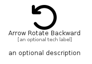

# ArrowRotateBackward


```text
fontawesome/Solid/ArrowRotateBackward
```

```text
include('fontawesome/Solid/ArrowRotateBackward')
```


| Illustration | ArrowRotateBackward |
| :---: | :---: |
|  |  |


## Sprites
The item provides the following sriptes:

- `<$ArrowRotateBackwardXs>`
- `<$ArrowRotateBackwardSm>`
- `<$ArrowRotateBackwardMd>`
- `<$ArrowRotateBackwardLg>`


## ArrowRotateBackward

### Load remotely
```plantuml
@startuml
' configures the library
!global $LIB_BASE_LOCATION="https://raw.githubusercontent.com/tmorin/plantuml-libs/master/distribution"

' loads the library's bootstrap
!include $LIB_BASE_LOCATION/bootstrap.puml

' loads the package bootstrap
include('fontawesome/bootstrap')

' loads the Item which embeds the element ArrowRotateBackward
include('fontawesome/Solid/ArrowRotateBackward')

' renders the element
ArrowRotateBackward('ArrowRotateBackward', 'Arrow Rotate Backward', 'an optional tech label', 'an optional description')
@enduml
```

### Load locally
```plantuml
@startuml
' configures the library
!global $INCLUSION_MODE="local"
!global $LIB_BASE_LOCATION="../.."

' loads the library's bootstrap
!include $LIB_BASE_LOCATION/bootstrap.puml

' loads the package bootstrap
include('fontawesome/bootstrap')

' loads the Item which embeds the element ArrowRotateBackward
include('fontawesome/Solid/ArrowRotateBackward')

' renders the element
ArrowRotateBackward('ArrowRotateBackward', 'Arrow Rotate Backward', 'an optional tech label', 'an optional description')
@enduml
```

