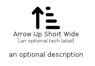

# ArrowUpShortWide


```text
fontawesome/Solid/ArrowUpShortWide
```

```text
include('fontawesome/Solid/ArrowUpShortWide')
```


| Illustration | ArrowUpShortWide |
| :---: | :---: |
|  |  |


## Sprites
The item provides the following sriptes:

- `<$ArrowUpShortWideXs>`
- `<$ArrowUpShortWideSm>`
- `<$ArrowUpShortWideMd>`
- `<$ArrowUpShortWideLg>`


## ArrowUpShortWide

### Load remotely
```plantuml
@startuml
' configures the library
!global $LIB_BASE_LOCATION="https://raw.githubusercontent.com/tmorin/plantuml-libs/master/distribution"

' loads the library's bootstrap
!include $LIB_BASE_LOCATION/bootstrap.puml

' loads the package bootstrap
include('fontawesome/bootstrap')

' loads the Item which embeds the element ArrowUpShortWide
include('fontawesome/Solid/ArrowUpShortWide')

' renders the element
ArrowUpShortWide('ArrowUpShortWide', 'Arrow Up Short Wide', 'an optional tech label', 'an optional description')
@enduml
```

### Load locally
```plantuml
@startuml
' configures the library
!global $INCLUSION_MODE="local"
!global $LIB_BASE_LOCATION="../.."

' loads the library's bootstrap
!include $LIB_BASE_LOCATION/bootstrap.puml

' loads the package bootstrap
include('fontawesome/bootstrap')

' loads the Item which embeds the element ArrowUpShortWide
include('fontawesome/Solid/ArrowUpShortWide')

' renders the element
ArrowUpShortWide('ArrowUpShortWide', 'Arrow Up Short Wide', 'an optional tech label', 'an optional description')
@enduml
```

