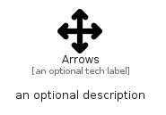

# Arrows


```text
fontawesome/Solid/Arrows
```

```text
include('fontawesome/Solid/Arrows')
```


| Illustration | Arrows |
| :---: | :---: |
|  |  |


## Sprites
The item provides the following sriptes:

- `<$ArrowsXs>`
- `<$ArrowsSm>`
- `<$ArrowsMd>`
- `<$ArrowsLg>`


## Arrows

### Load remotely
```plantuml
@startuml
' configures the library
!global $LIB_BASE_LOCATION="https://raw.githubusercontent.com/tmorin/plantuml-libs/master/distribution"

' loads the library's bootstrap
!include $LIB_BASE_LOCATION/bootstrap.puml

' loads the package bootstrap
include('fontawesome/bootstrap')

' loads the Item which embeds the element Arrows
include('fontawesome/Solid/Arrows')

' renders the element
Arrows('Arrows', 'Arrows', 'an optional tech label', 'an optional description')
@enduml
```

### Load locally
```plantuml
@startuml
' configures the library
!global $INCLUSION_MODE="local"
!global $LIB_BASE_LOCATION="../.."

' loads the library's bootstrap
!include $LIB_BASE_LOCATION/bootstrap.puml

' loads the package bootstrap
include('fontawesome/bootstrap')

' loads the Item which embeds the element Arrows
include('fontawesome/Solid/Arrows')

' renders the element
Arrows('Arrows', 'Arrows', 'an optional tech label', 'an optional description')
@enduml
```

