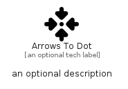

# ArrowsToDot


```text
fontawesome/Solid/ArrowsToDot
```

```text
include('fontawesome/Solid/ArrowsToDot')
```


| Illustration | ArrowsToDot |
| :---: | :---: |
|  |  |


## Sprites
The item provides the following sriptes:

- `<$ArrowsToDotXs>`
- `<$ArrowsToDotSm>`
- `<$ArrowsToDotMd>`
- `<$ArrowsToDotLg>`


## ArrowsToDot

### Load remotely
```plantuml
@startuml
' configures the library
!global $LIB_BASE_LOCATION="https://raw.githubusercontent.com/tmorin/plantuml-libs/master/distribution"

' loads the library's bootstrap
!include $LIB_BASE_LOCATION/bootstrap.puml

' loads the package bootstrap
include('fontawesome/bootstrap')

' loads the Item which embeds the element ArrowsToDot
include('fontawesome/Solid/ArrowsToDot')

' renders the element
ArrowsToDot('ArrowsToDot', 'Arrows To Dot', 'an optional tech label', 'an optional description')
@enduml
```

### Load locally
```plantuml
@startuml
' configures the library
!global $INCLUSION_MODE="local"
!global $LIB_BASE_LOCATION="../.."

' loads the library's bootstrap
!include $LIB_BASE_LOCATION/bootstrap.puml

' loads the package bootstrap
include('fontawesome/bootstrap')

' loads the Item which embeds the element ArrowsToDot
include('fontawesome/Solid/ArrowsToDot')

' renders the element
ArrowsToDot('ArrowsToDot', 'Arrows To Dot', 'an optional tech label', 'an optional description')
@enduml
```

