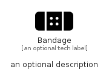

# Bandage


```text
fontawesome/Solid/Bandage
```

```text
include('fontawesome/Solid/Bandage')
```


| Illustration | Bandage |
| :---: | :---: |
|  |  |


## Sprites
The item provides the following sriptes:

- `<$BandageXs>`
- `<$BandageSm>`
- `<$BandageMd>`
- `<$BandageLg>`


## Bandage

### Load remotely
```plantuml
@startuml
' configures the library
!global $LIB_BASE_LOCATION="https://raw.githubusercontent.com/tmorin/plantuml-libs/master/distribution"

' loads the library's bootstrap
!include $LIB_BASE_LOCATION/bootstrap.puml

' loads the package bootstrap
include('fontawesome/bootstrap')

' loads the Item which embeds the element Bandage
include('fontawesome/Solid/Bandage')

' renders the element
Bandage('Bandage', 'Bandage', 'an optional tech label', 'an optional description')
@enduml
```

### Load locally
```plantuml
@startuml
' configures the library
!global $INCLUSION_MODE="local"
!global $LIB_BASE_LOCATION="../.."

' loads the library's bootstrap
!include $LIB_BASE_LOCATION/bootstrap.puml

' loads the package bootstrap
include('fontawesome/bootstrap')

' loads the Item which embeds the element Bandage
include('fontawesome/Solid/Bandage')

' renders the element
Bandage('Bandage', 'Bandage', 'an optional tech label', 'an optional description')
@enduml
```

