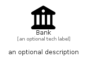

# Bank


```text
fontawesome/Solid/Bank
```

```text
include('fontawesome/Solid/Bank')
```


| Illustration | Bank |
| :---: | :---: |
|  |  |


## Sprites
The item provides the following sriptes:

- `<$BankXs>`
- `<$BankSm>`
- `<$BankMd>`
- `<$BankLg>`


## Bank

### Load remotely
```plantuml
@startuml
' configures the library
!global $LIB_BASE_LOCATION="https://raw.githubusercontent.com/tmorin/plantuml-libs/master/distribution"

' loads the library's bootstrap
!include $LIB_BASE_LOCATION/bootstrap.puml

' loads the package bootstrap
include('fontawesome/bootstrap')

' loads the Item which embeds the element Bank
include('fontawesome/Solid/Bank')

' renders the element
Bank('Bank', 'Bank', 'an optional tech label', 'an optional description')
@enduml
```

### Load locally
```plantuml
@startuml
' configures the library
!global $INCLUSION_MODE="local"
!global $LIB_BASE_LOCATION="../.."

' loads the library's bootstrap
!include $LIB_BASE_LOCATION/bootstrap.puml

' loads the package bootstrap
include('fontawesome/bootstrap')

' loads the Item which embeds the element Bank
include('fontawesome/Solid/Bank')

' renders the element
Bank('Bank', 'Bank', 'an optional tech label', 'an optional description')
@enduml
```

