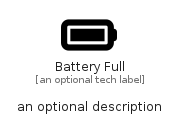

# BatteryFull


```text
fontawesome/Solid/BatteryFull
```

```text
include('fontawesome/Solid/BatteryFull')
```


| Illustration | BatteryFull |
| :---: | :---: |
|  |  |


## Sprites
The item provides the following sriptes:

- `<$BatteryFullXs>`
- `<$BatteryFullSm>`
- `<$BatteryFullMd>`
- `<$BatteryFullLg>`


## BatteryFull

### Load remotely
```plantuml
@startuml
' configures the library
!global $LIB_BASE_LOCATION="https://raw.githubusercontent.com/tmorin/plantuml-libs/master/distribution"

' loads the library's bootstrap
!include $LIB_BASE_LOCATION/bootstrap.puml

' loads the package bootstrap
include('fontawesome/bootstrap')

' loads the Item which embeds the element BatteryFull
include('fontawesome/Solid/BatteryFull')

' renders the element
BatteryFull('BatteryFull', 'Battery Full', 'an optional tech label', 'an optional description')
@enduml
```

### Load locally
```plantuml
@startuml
' configures the library
!global $INCLUSION_MODE="local"
!global $LIB_BASE_LOCATION="../.."

' loads the library's bootstrap
!include $LIB_BASE_LOCATION/bootstrap.puml

' loads the package bootstrap
include('fontawesome/bootstrap')

' loads the Item which embeds the element BatteryFull
include('fontawesome/Solid/BatteryFull')

' renders the element
BatteryFull('BatteryFull', 'Battery Full', 'an optional tech label', 'an optional description')
@enduml
```

