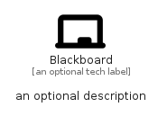

# Blackboard


```text
fontawesome/Solid/Blackboard
```

```text
include('fontawesome/Solid/Blackboard')
```


| Illustration | Blackboard |
| :---: | :---: |
|  |  |


## Sprites
The item provides the following sriptes:

- `<$BlackboardXs>`
- `<$BlackboardSm>`
- `<$BlackboardMd>`
- `<$BlackboardLg>`


## Blackboard

### Load remotely
```plantuml
@startuml
' configures the library
!global $LIB_BASE_LOCATION="https://raw.githubusercontent.com/tmorin/plantuml-libs/master/distribution"

' loads the library's bootstrap
!include $LIB_BASE_LOCATION/bootstrap.puml

' loads the package bootstrap
include('fontawesome/bootstrap')

' loads the Item which embeds the element Blackboard
include('fontawesome/Solid/Blackboard')

' renders the element
Blackboard('Blackboard', 'Blackboard', 'an optional tech label', 'an optional description')
@enduml
```

### Load locally
```plantuml
@startuml
' configures the library
!global $INCLUSION_MODE="local"
!global $LIB_BASE_LOCATION="../.."

' loads the library's bootstrap
!include $LIB_BASE_LOCATION/bootstrap.puml

' loads the package bootstrap
include('fontawesome/bootstrap')

' loads the Item which embeds the element Blackboard
include('fontawesome/Solid/Blackboard')

' renders the element
Blackboard('Blackboard', 'Blackboard', 'an optional tech label', 'an optional description')
@enduml
```

