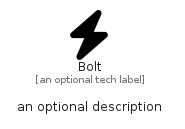

# Bolt


```text
fontawesome/Solid/Bolt
```

```text
include('fontawesome/Solid/Bolt')
```


| Illustration | Bolt |
| :---: | :---: |
|  |  |


## Sprites
The item provides the following sriptes:

- `<$BoltXs>`
- `<$BoltSm>`
- `<$BoltMd>`
- `<$BoltLg>`


## Bolt

### Load remotely
```plantuml
@startuml
' configures the library
!global $LIB_BASE_LOCATION="https://raw.githubusercontent.com/tmorin/plantuml-libs/master/distribution"

' loads the library's bootstrap
!include $LIB_BASE_LOCATION/bootstrap.puml

' loads the package bootstrap
include('fontawesome/bootstrap')

' loads the Item which embeds the element Bolt
include('fontawesome/Solid/Bolt')

' renders the element
Bolt('Bolt', 'Bolt', 'an optional tech label', 'an optional description')
@enduml
```

### Load locally
```plantuml
@startuml
' configures the library
!global $INCLUSION_MODE="local"
!global $LIB_BASE_LOCATION="../.."

' loads the library's bootstrap
!include $LIB_BASE_LOCATION/bootstrap.puml

' loads the package bootstrap
include('fontawesome/bootstrap')

' loads the Item which embeds the element Bolt
include('fontawesome/Solid/Bolt')

' renders the element
Bolt('Bolt', 'Bolt', 'an optional tech label', 'an optional description')
@enduml
```

