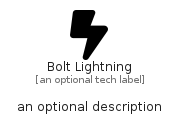

# BoltLightning


```text
fontawesome/Solid/BoltLightning
```

```text
include('fontawesome/Solid/BoltLightning')
```


| Illustration | BoltLightning |
| :---: | :---: |
|  |  |


## Sprites
The item provides the following sriptes:

- `<$BoltLightningXs>`
- `<$BoltLightningSm>`
- `<$BoltLightningMd>`
- `<$BoltLightningLg>`


## BoltLightning

### Load remotely
```plantuml
@startuml
' configures the library
!global $LIB_BASE_LOCATION="https://raw.githubusercontent.com/tmorin/plantuml-libs/master/distribution"

' loads the library's bootstrap
!include $LIB_BASE_LOCATION/bootstrap.puml

' loads the package bootstrap
include('fontawesome/bootstrap')

' loads the Item which embeds the element BoltLightning
include('fontawesome/Solid/BoltLightning')

' renders the element
BoltLightning('BoltLightning', 'Bolt Lightning', 'an optional tech label', 'an optional description')
@enduml
```

### Load locally
```plantuml
@startuml
' configures the library
!global $INCLUSION_MODE="local"
!global $LIB_BASE_LOCATION="../.."

' loads the library's bootstrap
!include $LIB_BASE_LOCATION/bootstrap.puml

' loads the package bootstrap
include('fontawesome/bootstrap')

' loads the Item which embeds the element BoltLightning
include('fontawesome/Solid/BoltLightning')

' renders the element
BoltLightning('BoltLightning', 'Bolt Lightning', 'an optional tech label', 'an optional description')
@enduml
```

