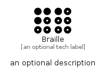

# Braille


```text
fontawesome/Solid/Braille
```

```text
include('fontawesome/Solid/Braille')
```


| Illustration | Braille |
| :---: | :---: |
|  |  |


## Sprites
The item provides the following sriptes:

- `<$BrailleXs>`
- `<$BrailleSm>`
- `<$BrailleMd>`
- `<$BrailleLg>`


## Braille

### Load remotely
```plantuml
@startuml
' configures the library
!global $LIB_BASE_LOCATION="https://raw.githubusercontent.com/tmorin/plantuml-libs/master/distribution"

' loads the library's bootstrap
!include $LIB_BASE_LOCATION/bootstrap.puml

' loads the package bootstrap
include('fontawesome/bootstrap')

' loads the Item which embeds the element Braille
include('fontawesome/Solid/Braille')

' renders the element
Braille('Braille', 'Braille', 'an optional tech label', 'an optional description')
@enduml
```

### Load locally
```plantuml
@startuml
' configures the library
!global $INCLUSION_MODE="local"
!global $LIB_BASE_LOCATION="../.."

' loads the library's bootstrap
!include $LIB_BASE_LOCATION/bootstrap.puml

' loads the package bootstrap
include('fontawesome/bootstrap')

' loads the Item which embeds the element Braille
include('fontawesome/Solid/Braille')

' renders the element
Braille('Braille', 'Braille', 'an optional tech label', 'an optional description')
@enduml
```

