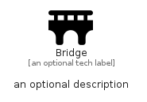

# Bridge


```text
fontawesome/Solid/Bridge
```

```text
include('fontawesome/Solid/Bridge')
```


| Illustration | Bridge |
| :---: | :---: |
|  |  |


## Sprites
The item provides the following sriptes:

- `<$BridgeXs>`
- `<$BridgeSm>`
- `<$BridgeMd>`
- `<$BridgeLg>`


## Bridge

### Load remotely
```plantuml
@startuml
' configures the library
!global $LIB_BASE_LOCATION="https://raw.githubusercontent.com/tmorin/plantuml-libs/master/distribution"

' loads the library's bootstrap
!include $LIB_BASE_LOCATION/bootstrap.puml

' loads the package bootstrap
include('fontawesome/bootstrap')

' loads the Item which embeds the element Bridge
include('fontawesome/Solid/Bridge')

' renders the element
Bridge('Bridge', 'Bridge', 'an optional tech label', 'an optional description')
@enduml
```

### Load locally
```plantuml
@startuml
' configures the library
!global $INCLUSION_MODE="local"
!global $LIB_BASE_LOCATION="../.."

' loads the library's bootstrap
!include $LIB_BASE_LOCATION/bootstrap.puml

' loads the package bootstrap
include('fontawesome/bootstrap')

' loads the Item which embeds the element Bridge
include('fontawesome/Solid/Bridge')

' renders the element
Bridge('Bridge', 'Bridge', 'an optional tech label', 'an optional description')
@enduml
```

