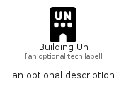

# BuildingUn


```text
fontawesome/Solid/BuildingUn
```

```text
include('fontawesome/Solid/BuildingUn')
```


| Illustration | BuildingUn |
| :---: | :---: |
|  |  |


## Sprites
The item provides the following sriptes:

- `<$BuildingUnXs>`
- `<$BuildingUnSm>`
- `<$BuildingUnMd>`
- `<$BuildingUnLg>`


## BuildingUn

### Load remotely
```plantuml
@startuml
' configures the library
!global $LIB_BASE_LOCATION="https://raw.githubusercontent.com/tmorin/plantuml-libs/master/distribution"

' loads the library's bootstrap
!include $LIB_BASE_LOCATION/bootstrap.puml

' loads the package bootstrap
include('fontawesome/bootstrap')

' loads the Item which embeds the element BuildingUn
include('fontawesome/Solid/BuildingUn')

' renders the element
BuildingUn('BuildingUn', 'Building Un', 'an optional tech label', 'an optional description')
@enduml
```

### Load locally
```plantuml
@startuml
' configures the library
!global $INCLUSION_MODE="local"
!global $LIB_BASE_LOCATION="../.."

' loads the library's bootstrap
!include $LIB_BASE_LOCATION/bootstrap.puml

' loads the package bootstrap
include('fontawesome/bootstrap')

' loads the Item which embeds the element BuildingUn
include('fontawesome/Solid/BuildingUn')

' renders the element
BuildingUn('BuildingUn', 'Building Un', 'an optional tech label', 'an optional description')
@enduml
```

