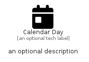

# CalendarDay


```text
fontawesome/Solid/CalendarDay
```

```text
include('fontawesome/Solid/CalendarDay')
```


| Illustration | CalendarDay |
| :---: | :---: |
|  |  |


## Sprites
The item provides the following sriptes:

- `<$CalendarDayXs>`
- `<$CalendarDaySm>`
- `<$CalendarDayMd>`
- `<$CalendarDayLg>`


## CalendarDay

### Load remotely
```plantuml
@startuml
' configures the library
!global $LIB_BASE_LOCATION="https://raw.githubusercontent.com/tmorin/plantuml-libs/master/distribution"

' loads the library's bootstrap
!include $LIB_BASE_LOCATION/bootstrap.puml

' loads the package bootstrap
include('fontawesome/bootstrap')

' loads the Item which embeds the element CalendarDay
include('fontawesome/Solid/CalendarDay')

' renders the element
CalendarDay('CalendarDay', 'Calendar Day', 'an optional tech label', 'an optional description')
@enduml
```

### Load locally
```plantuml
@startuml
' configures the library
!global $INCLUSION_MODE="local"
!global $LIB_BASE_LOCATION="../.."

' loads the library's bootstrap
!include $LIB_BASE_LOCATION/bootstrap.puml

' loads the package bootstrap
include('fontawesome/bootstrap')

' loads the Item which embeds the element CalendarDay
include('fontawesome/Solid/CalendarDay')

' renders the element
CalendarDay('CalendarDay', 'Calendar Day', 'an optional tech label', 'an optional description')
@enduml
```

