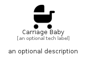

# CarriageBaby


```text
fontawesome/Solid/CarriageBaby
```

```text
include('fontawesome/Solid/CarriageBaby')
```


| Illustration | CarriageBaby |
| :---: | :---: |
|  |  |


## Sprites
The item provides the following sriptes:

- `<$CarriageBabyXs>`
- `<$CarriageBabySm>`
- `<$CarriageBabyMd>`
- `<$CarriageBabyLg>`


## CarriageBaby

### Load remotely
```plantuml
@startuml
' configures the library
!global $LIB_BASE_LOCATION="https://raw.githubusercontent.com/tmorin/plantuml-libs/master/distribution"

' loads the library's bootstrap
!include $LIB_BASE_LOCATION/bootstrap.puml

' loads the package bootstrap
include('fontawesome/bootstrap')

' loads the Item which embeds the element CarriageBaby
include('fontawesome/Solid/CarriageBaby')

' renders the element
CarriageBaby('CarriageBaby', 'Carriage Baby', 'an optional tech label', 'an optional description')
@enduml
```

### Load locally
```plantuml
@startuml
' configures the library
!global $INCLUSION_MODE="local"
!global $LIB_BASE_LOCATION="../.."

' loads the library's bootstrap
!include $LIB_BASE_LOCATION/bootstrap.puml

' loads the package bootstrap
include('fontawesome/bootstrap')

' loads the Item which embeds the element CarriageBaby
include('fontawesome/Solid/CarriageBaby')

' renders the element
CarriageBaby('CarriageBaby', 'Carriage Baby', 'an optional tech label', 'an optional description')
@enduml
```

