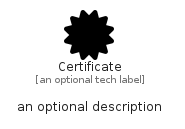

# Certificate


```text
fontawesome/Solid/Certificate
```

```text
include('fontawesome/Solid/Certificate')
```


| Illustration | Certificate |
| :---: | :---: |
|  |  |


## Sprites
The item provides the following sriptes:

- `<$CertificateXs>`
- `<$CertificateSm>`
- `<$CertificateMd>`
- `<$CertificateLg>`


## Certificate

### Load remotely
```plantuml
@startuml
' configures the library
!global $LIB_BASE_LOCATION="https://raw.githubusercontent.com/tmorin/plantuml-libs/master/distribution"

' loads the library's bootstrap
!include $LIB_BASE_LOCATION/bootstrap.puml

' loads the package bootstrap
include('fontawesome/bootstrap')

' loads the Item which embeds the element Certificate
include('fontawesome/Solid/Certificate')

' renders the element
Certificate('Certificate', 'Certificate', 'an optional tech label', 'an optional description')
@enduml
```

### Load locally
```plantuml
@startuml
' configures the library
!global $INCLUSION_MODE="local"
!global $LIB_BASE_LOCATION="../.."

' loads the library's bootstrap
!include $LIB_BASE_LOCATION/bootstrap.puml

' loads the package bootstrap
include('fontawesome/bootstrap')

' loads the Item which embeds the element Certificate
include('fontawesome/Solid/Certificate')

' renders the element
Certificate('Certificate', 'Certificate', 'an optional tech label', 'an optional description')
@enduml
```

