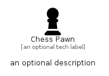

# ChessPawn


```text
fontawesome/Solid/ChessPawn
```

```text
include('fontawesome/Solid/ChessPawn')
```


| Illustration | ChessPawn |
| :---: | :---: |
|  |  |


## Sprites
The item provides the following sriptes:

- `<$ChessPawnXs>`
- `<$ChessPawnSm>`
- `<$ChessPawnMd>`
- `<$ChessPawnLg>`


## ChessPawn

### Load remotely
```plantuml
@startuml
' configures the library
!global $LIB_BASE_LOCATION="https://raw.githubusercontent.com/tmorin/plantuml-libs/master/distribution"

' loads the library's bootstrap
!include $LIB_BASE_LOCATION/bootstrap.puml

' loads the package bootstrap
include('fontawesome/bootstrap')

' loads the Item which embeds the element ChessPawn
include('fontawesome/Solid/ChessPawn')

' renders the element
ChessPawn('ChessPawn', 'Chess Pawn', 'an optional tech label', 'an optional description')
@enduml
```

### Load locally
```plantuml
@startuml
' configures the library
!global $INCLUSION_MODE="local"
!global $LIB_BASE_LOCATION="../.."

' loads the library's bootstrap
!include $LIB_BASE_LOCATION/bootstrap.puml

' loads the package bootstrap
include('fontawesome/bootstrap')

' loads the Item which embeds the element ChessPawn
include('fontawesome/Solid/ChessPawn')

' renders the element
ChessPawn('ChessPawn', 'Chess Pawn', 'an optional tech label', 'an optional description')
@enduml
```

