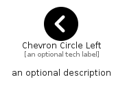

# ChevronCircleLeft


```text
fontawesome/Solid/ChevronCircleLeft
```

```text
include('fontawesome/Solid/ChevronCircleLeft')
```


| Illustration | ChevronCircleLeft |
| :---: | :---: |
|  |  |


## Sprites
The item provides the following sriptes:

- `<$ChevronCircleLeftXs>`
- `<$ChevronCircleLeftSm>`
- `<$ChevronCircleLeftMd>`
- `<$ChevronCircleLeftLg>`


## ChevronCircleLeft

### Load remotely
```plantuml
@startuml
' configures the library
!global $LIB_BASE_LOCATION="https://raw.githubusercontent.com/tmorin/plantuml-libs/master/distribution"

' loads the library's bootstrap
!include $LIB_BASE_LOCATION/bootstrap.puml

' loads the package bootstrap
include('fontawesome/bootstrap')

' loads the Item which embeds the element ChevronCircleLeft
include('fontawesome/Solid/ChevronCircleLeft')

' renders the element
ChevronCircleLeft('ChevronCircleLeft', 'Chevron Circle Left', 'an optional tech label', 'an optional description')
@enduml
```

### Load locally
```plantuml
@startuml
' configures the library
!global $INCLUSION_MODE="local"
!global $LIB_BASE_LOCATION="../.."

' loads the library's bootstrap
!include $LIB_BASE_LOCATION/bootstrap.puml

' loads the package bootstrap
include('fontawesome/bootstrap')

' loads the Item which embeds the element ChevronCircleLeft
include('fontawesome/Solid/ChevronCircleLeft')

' renders the element
ChevronCircleLeft('ChevronCircleLeft', 'Chevron Circle Left', 'an optional tech label', 'an optional description')
@enduml
```

