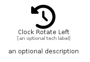

# ClockRotateLeft


```text
fontawesome/Solid/ClockRotateLeft
```

```text
include('fontawesome/Solid/ClockRotateLeft')
```


| Illustration | ClockRotateLeft |
| :---: | :---: |
|  |  |


## Sprites
The item provides the following sriptes:

- `<$ClockRotateLeftXs>`
- `<$ClockRotateLeftSm>`
- `<$ClockRotateLeftMd>`
- `<$ClockRotateLeftLg>`


## ClockRotateLeft

### Load remotely
```plantuml
@startuml
' configures the library
!global $LIB_BASE_LOCATION="https://raw.githubusercontent.com/tmorin/plantuml-libs/master/distribution"

' loads the library's bootstrap
!include $LIB_BASE_LOCATION/bootstrap.puml

' loads the package bootstrap
include('fontawesome/bootstrap')

' loads the Item which embeds the element ClockRotateLeft
include('fontawesome/Solid/ClockRotateLeft')

' renders the element
ClockRotateLeft('ClockRotateLeft', 'Clock Rotate Left', 'an optional tech label', 'an optional description')
@enduml
```

### Load locally
```plantuml
@startuml
' configures the library
!global $INCLUSION_MODE="local"
!global $LIB_BASE_LOCATION="../.."

' loads the library's bootstrap
!include $LIB_BASE_LOCATION/bootstrap.puml

' loads the package bootstrap
include('fontawesome/bootstrap')

' loads the Item which embeds the element ClockRotateLeft
include('fontawesome/Solid/ClockRotateLeft')

' renders the element
ClockRotateLeft('ClockRotateLeft', 'Clock Rotate Left', 'an optional tech label', 'an optional description')
@enduml
```

