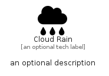

# CloudRain


```text
fontawesome/Solid/CloudRain
```

```text
include('fontawesome/Solid/CloudRain')
```


| Illustration | CloudRain |
| :---: | :---: |
|  |  |


## Sprites
The item provides the following sriptes:

- `<$CloudRainXs>`
- `<$CloudRainSm>`
- `<$CloudRainMd>`
- `<$CloudRainLg>`


## CloudRain

### Load remotely
```plantuml
@startuml
' configures the library
!global $LIB_BASE_LOCATION="https://raw.githubusercontent.com/tmorin/plantuml-libs/master/distribution"

' loads the library's bootstrap
!include $LIB_BASE_LOCATION/bootstrap.puml

' loads the package bootstrap
include('fontawesome/bootstrap')

' loads the Item which embeds the element CloudRain
include('fontawesome/Solid/CloudRain')

' renders the element
CloudRain('CloudRain', 'Cloud Rain', 'an optional tech label', 'an optional description')
@enduml
```

### Load locally
```plantuml
@startuml
' configures the library
!global $INCLUSION_MODE="local"
!global $LIB_BASE_LOCATION="../.."

' loads the library's bootstrap
!include $LIB_BASE_LOCATION/bootstrap.puml

' loads the package bootstrap
include('fontawesome/bootstrap')

' loads the Item which embeds the element CloudRain
include('fontawesome/Solid/CloudRain')

' renders the element
CloudRain('CloudRain', 'Cloud Rain', 'an optional tech label', 'an optional description')
@enduml
```

