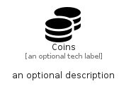

# Coins


```text
fontawesome/Solid/Coins
```

```text
include('fontawesome/Solid/Coins')
```


| Illustration | Coins |
| :---: | :---: |
|  |  |


## Sprites
The item provides the following sriptes:

- `<$CoinsXs>`
- `<$CoinsSm>`
- `<$CoinsMd>`
- `<$CoinsLg>`


## Coins

### Load remotely
```plantuml
@startuml
' configures the library
!global $LIB_BASE_LOCATION="https://raw.githubusercontent.com/tmorin/plantuml-libs/master/distribution"

' loads the library's bootstrap
!include $LIB_BASE_LOCATION/bootstrap.puml

' loads the package bootstrap
include('fontawesome/bootstrap')

' loads the Item which embeds the element Coins
include('fontawesome/Solid/Coins')

' renders the element
Coins('Coins', 'Coins', 'an optional tech label', 'an optional description')
@enduml
```

### Load locally
```plantuml
@startuml
' configures the library
!global $INCLUSION_MODE="local"
!global $LIB_BASE_LOCATION="../.."

' loads the library's bootstrap
!include $LIB_BASE_LOCATION/bootstrap.puml

' loads the package bootstrap
include('fontawesome/bootstrap')

' loads the Item which embeds the element Coins
include('fontawesome/Solid/Coins')

' renders the element
Coins('Coins', 'Coins', 'an optional tech label', 'an optional description')
@enduml
```

