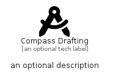

# CompassDrafting


```text
fontawesome/Solid/CompassDrafting
```

```text
include('fontawesome/Solid/CompassDrafting')
```


| Illustration | CompassDrafting |
| :---: | :---: |
|  |  |


## Sprites
The item provides the following sriptes:

- `<$CompassDraftingXs>`
- `<$CompassDraftingSm>`
- `<$CompassDraftingMd>`
- `<$CompassDraftingLg>`


## CompassDrafting

### Load remotely
```plantuml
@startuml
' configures the library
!global $LIB_BASE_LOCATION="https://raw.githubusercontent.com/tmorin/plantuml-libs/master/distribution"

' loads the library's bootstrap
!include $LIB_BASE_LOCATION/bootstrap.puml

' loads the package bootstrap
include('fontawesome/bootstrap')

' loads the Item which embeds the element CompassDrafting
include('fontawesome/Solid/CompassDrafting')

' renders the element
CompassDrafting('CompassDrafting', 'Compass Drafting', 'an optional tech label', 'an optional description')
@enduml
```

### Load locally
```plantuml
@startuml
' configures the library
!global $INCLUSION_MODE="local"
!global $LIB_BASE_LOCATION="../.."

' loads the library's bootstrap
!include $LIB_BASE_LOCATION/bootstrap.puml

' loads the package bootstrap
include('fontawesome/bootstrap')

' loads the Item which embeds the element CompassDrafting
include('fontawesome/Solid/CompassDrafting')

' renders the element
CompassDrafting('CompassDrafting', 'Compass Drafting', 'an optional tech label', 'an optional description')
@enduml
```

